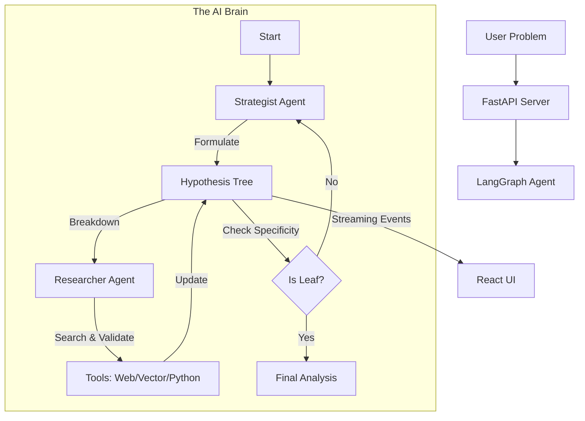

# The AI Strategy Consultant

> **Automated McKinsey-style problem solving powered by Multi-Agent AI.**

[](https://python.org)
[](https://langchain.com)
[](https://fastapi.tiangolo.com)
[](https://react.dev)
[](https://openai.com)

## Overview

The **AI Strategy Consultant** is an autonomous agentic system designed to simulate the workflow of a top-tier management consultant. Unlike standard chatbots, this system doesn't just answer questions—it **breaks them down**.

Using a stateful **LangGraph** architecture, the agent recursively:
1.  **Formulates Hypotheses** (MECE framework)
2.  **Conducts Deep Research** (Web search + Vector memory)
3.  **Analyzes Data** (Python REPL + Chart generation)
4.  **Synthesizes Insights** (Structured reporting)

The result is a dynamic **Hypothesis Tree** visualized in real-time, allowing users to watch the "brain" of the AI at work as it solves complex ambiguous business problems.

---

## Key Features

### Autonomous Agent Logic (LangGraph)
*   **Stateful Workflow**: Moving beyond simple chains, the agent maintains a complex state (`AgentState`) allowing for loops, retries, and human-in-the-loop approval.
*   **Multi-Persona Architecture**:
    *   **The Strategist**: High-level planning, breaking down problems into sub-hypotheses.
    *   **The Researcher**: Executing targeted web searches and vector store queries to validate assumptions.
*   **Self-Correction**: The graph includes "Safety Nets" to catch orphaned logic nodes and ensure comprehensive coverage.

### Modern Tech Stack
*   **Backend**: Python, FastAPI, and Server-Sent Events (SSE) for real-time streaming of thought processes.
*   **Frontend**: A modern **React** application using **ReactFlow** to visualize the living hypothesis tree.
*   **Memory**: **Cosmos DB** integration for persisting user sessions and research artifacts.

### "Consultant" Tooling
*   **MECE Structuring**: Prompts engineered to enforce *Mutually Exclusive, Collectively Exhaustive* breakdowns.
*   **Code Interpreter**: Ability to run Python snippets on the fly to calculate figures or generate matplotlib charts.
*   **Evidence-Backed**: Every node in the tree is supported by cited sources from live web research.

---

## Architecture



## Getting Started

### Prerequisites
*   Python 3.10+
*   Node.js & npm
*   OpenAI API Key

### 1. Backend Setup
```bash
# Clone the repository
git clone https://github.com/your-username/ai-consultant.git

# Install dependencies
pip install -r requirements.txt

# Set up environment variables
export OPENAI_API_KEY="your_key_here"
# Optional: Cosmos DB credentials

# Run the server
python agent.py
```
*Server runs on `http://localhost:8000`*

### 2. Frontend Setup
```bash
cd web
npm install
npm start
```
*App opens at `http://localhost:3000`*

---

## Snapshots

*Visualize the complex reasoning chains typically hidden in black-box LLMs.*

| Hypothesis Tree | Deep Research |
|-----------------|---------------|
| *(Screenshot of the ReactFlow tree)* | *(Screenshot of the research logs)* |

---

## Future Roadmap
*   Support for local LLMs (Llama 3, Mistral) via Ollama.
*   Direct PPTX slide generation from final reports.
*   Multi-user collaboration on shared problem spaces.
